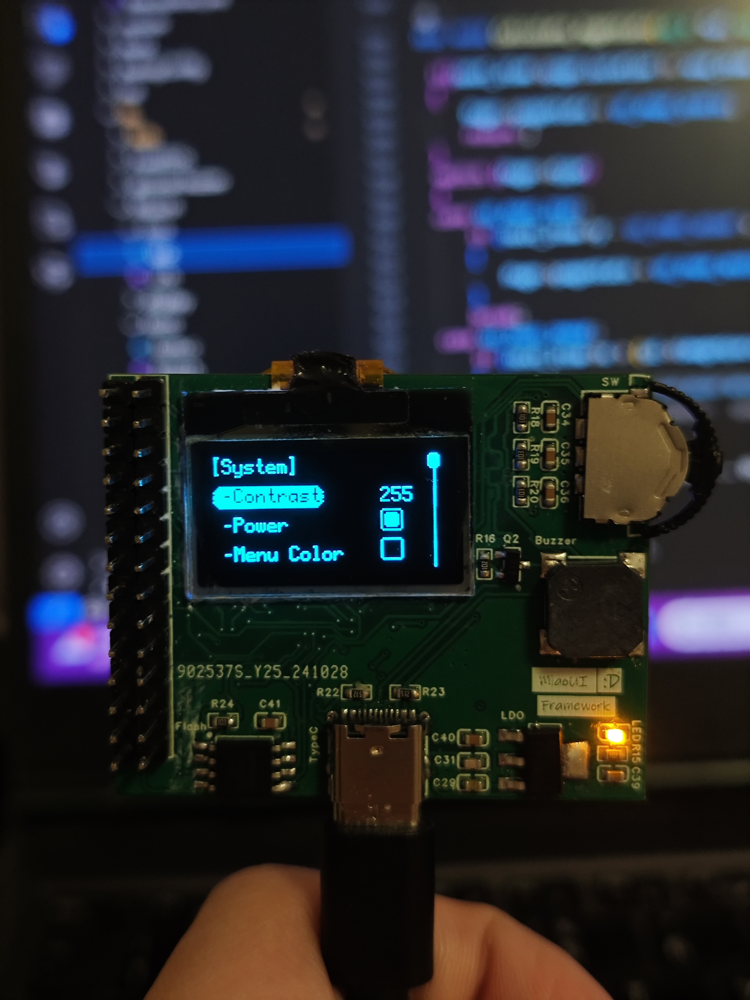
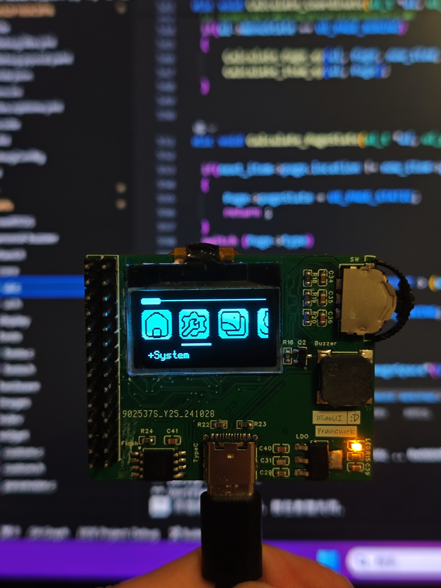

# MiaoUI

## 简介

[MiaoUI](http://github.com/JFeng-Z/MiaoUI) 是一个基于 [u8g2](https://github.com/olikraus/u8g2) 的单色 OLED 菜单 UI 框架。MiaoUI使用 C 语言实现，采用双向链表结构，使用非线性动画、移植方便、内存占用较小、能够快速部署，适用于具有小型OLED屏幕的嵌入式设备。

- 🌈 **菜单类型**
    - 列表类菜单
    - 图标类菜单
- 🔔 **特点**
    - Q 弹的动画
    - 支持动画打断
    - 支持自定义功能
    - 支持列表与图标类菜单嵌套
    - 支持使用RTOS（待测试Bug）
- 📆 **功能**
    - 自动滚动显示过长标题
    - float、int、bool 类型数据调定
    - 列表单选框
    - 数据调定时可步进执行或退出执行
    - 动态显示只读数据
    - 循环运行自定义功能
    - 单次运行自定义功能
    - 波形显示
    - 文本显示
    - 任务结束弹窗
- ⚙️ **内存占用**（只存在一项菜单项前提下）:

    | Disk/ROM space      | Memory |
    | ----------- | ----------- |
    | 24KB      | 3.1KB       |

## 项目结构

```plaintext
MiaoUI
├─core              # UI绘制文件
│    ├─ui.c
│    └─ui.h
├─examples          # 示例代码
|    └─STM32F103C8T6        
├─fonts             # 字体文件
|    ├─fonts.c
|    └─fonts.h 
├─display           # 屏幕驱动文件
│    ├─dispDirver.c
│    └─dispDirver.h
├─indev             # 按键驱动文件
│    ├─indevDirver.c
│    └─indevDirver.h
├─images            # 图片文件
├─widget            # 各种控件
│    ├─custom       # 自定义控件
│    └─parameter    # 参数控件
│    └─text         # 文本显示
│    └─wave         # 波形显示
├─ version.h        # 版本信息
├─ ui_conf.c        # 菜单配置文件
├─ ui_conf.h        # 菜单配置文件
└─ README.md
```

## 使用
1. 移植 [u8g2](https://github.com/olikraus/u8g2) 库，在 ui_conf.h 中修改 OLED 屏幕的参数，如屏幕宽度、高度、字体信息、图标大小、间距等。
2. 在 ui_conf.c 中建立你所需的菜单。示例如下：

    ```c
    /* 定义页面 */
    ui_page_t Home_Page, System_Page;
    /* 定义菜单项 */
    ui_item_t HomeHead_Item, SystemHead_Item, System_Item, Github_Item;
    ui_item_t Contrast_Item;

    /**
     * 在此建立所需显示或更改的数据
     * 无参数
     * 无返回值
     */
    void Create_Parameter(ui_t *ui)
    {
        // 定义对比度变量，初始值为255，表示最大对比度
        static int Contrast = 255;
        // 创建一个ui_data_t类型的变量来管理对比度数据
        static ui_data_t Contrast_data;
        // 设置对比度数据的名称为"Contrast"
        Contrast_data.name = "Contrast";
        // 设置对比度数据的指针为Contrast变量的地址
        Contrast_data.ptr = &Contrast;
        // 设置对比度数据的处理函数为Disp_SetContrast
        Contrast_data.function = Disp_SetContrast;
        // 设置对比度数据的处理方式为单步执行
        Contrast_data.functionType = UI_DATA_FUNCTION_STEP_EXECUTE;
        // 设置对比度数据的数据类型为整型
        Contrast_data.dataType = UI_DATA_INT;
        // 设置对比度数据的操作类型为读写
        Contrast_data.actionType = UI_DATA_ACTION_RW;
        // 设置对比度数据的最大值为255
        Contrast_data.max = 255;
        // 设置对比度数据的最小值为0
        Contrast_data.min = 0;
        // 设置对比度数据的步长为5
        Contrast_data.step = 5;
        // 创建一个ui_element_t类型的变量来管理对比度元素
        static ui_element_t Contrast_element;
        // 设置对比度元素的数据为对比度数据的地址
        Contrast_element.data = &Contrast_data;
        // 创建对比度项和对比度元素，以在用户界面中使用
        Create_element(&Contrast_Item, &Contrast_element);
    }

    /**
     * 在此建立所需显示或更改的文本
     * 无参数
     * 无返回值
     */
    void Create_Text(ui_t *ui)
    {
        // 定义并初始化 GitHub 链接文本的 ui_text_t 结构体
        static ui_text_t github_text;
        github_text.font = UI_FONT;
        github_text.fontHight = UI_FONT_HIGHT;
        github_text.fontWidth = UI_FONT_WIDTH;
        github_text.ptr = VERSION_PROJECT_LINK;

        // 定义并初始化 GitHub 链接的 ui_element_t 结构体
        static ui_element_t github_element;
        github_element.text = &github_text;

        // 在界面上创建 GitHub 项目元素
        Create_element(&Github_Item, &github_element);
    }

    /*
    * 菜单构建函数
    * 该函数不接受参数，也不返回任何值。
    * 功能：静态地构建一个菜单系统。
    */
    void Create_MenuTree(ui_t *ui)
    {
        // 添加主页页面
        AddPage("[HomePage]", &Home_Page, UI_PAGE_ICON);
            // 在主页上添加一个一次性执行的函数项
            AddItem("[HomePage]", UI_ITEM_ONCE_FUNCTION, logo_allArray[0], &HomeHead_Item, &Home_Page, NULL, Draw_Home);
            // 添加一个父项，用于进入系统设置页面
            AddItem(" +System", UI_ITEM_PARENTS, logo_allArray[1], &System_Item, &Home_Page, &System_Page, NULL);
                // 添加系统设置页面
                AddPage("[System]", &System_Page, UI_PAGE_TEXT);
                    // 在系统设置页面上添加一个返回主页的项
                    AddItem("[System]", UI_ITEM_RETURN, NULL, &SystemHead_Item, &System_Page, &Home_Page, NULL);
                    // 添加一个数据项，用于调整对比度
                    AddItem(" -Contrast", UI_ITEM_DATA, NULL, &Contrast_Item, &System_Page, NULL, NULL);
        // 添加一个单词项，用于显示Github链接
        AddItem(" -Github", UI_ITEM_WORD, logo_allArray[3], &Github_Item, &Home_Page, NULL, NULL);
    }
    ```
3. 在displayDirver.c中添加对应的 u8g2 api （具体可参照例程），在indevDriver.c中添加你的按键驱动函数，按键至少需要三个（上、下、确认）。
4. 初始化你的屏幕和u8g2库。示例如下：
```c
extern u8g2_t u8g2;
void HAL_Display_Init(void)
{
    HardWare_I2C2_GPIOInit();
    u8g2_Setup_ssd1306_i2c_128x64_noname_f(&u8g2, U8G2_R2, u8x8_byte_hw_i2c, u8x8_gpio_and_delay_hw);
    u8g2_InitDisplay(&u8g2);                                            
    u8g2_SetPowerSave(&u8g2, 0);                                                       
    u8g2_ClearBuffer(&u8g2);
}
```
5. 定义一个ui_t结构体，并使用MiaoUi_Setup函数对其初始化。
6. 在你的主函数中调用ui_loop函数，以保持界面运行。

## 示例程序&PCB板
- 开发环境：Keil MDK，立创EDA专业版
- PCB：四层板
- 主控芯片：STM32F103C8T6
- 屏幕：OLED SSD1306 128*64
- 按键：拨轮开关
- I2C接口：硬件I2C2（SCL PB10，SDA PB11）
- Flash：W25Q64
- 陀螺仪&加速度计：MPU6050

## 效果

**1. 列表界面**

**2. 图标界面**


## 后期规划

- [ ] 支持更多分辨率的屏幕
- [ ] 适配RTOS
- [ ] 加入Flash文件系统

## 问题和建议

如果有什么问题或者建议欢迎提交 [issue](http://github.com/JFeng-Z/MiaoUI/issues) 进行讨论

## 鸣谢

- u8g2库: https://github.com/olikraus/u8g2
- github用户 [morepray](https://github.com/morepray): https://github.com/morepray/MorepUI
- 图标库: https://github.com/hugeicons/hugeicons-react
- 图片取模工具：https://javl.github.io/image2cpp/
